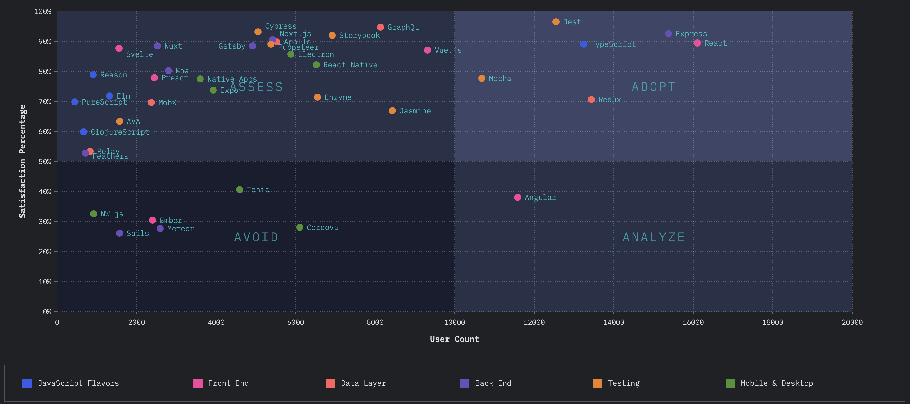

# How I got up to speed in Angular
## Learnings from my first month in Angular
Consider this article as a suggested roadmap for learning Angular, where the goal is to get familiar with the most important concepts in Angular, fast. For my first month working with Angular, I wrote down the resources I used. This article will save you the search for the right resources in an unknown landscape as I provide you some guidelines. That makes this article relevant:
- if you want to get started with Angular yourself,
- if you want a high-level overview of Angular concepts to compare it to **React** or to your view on Angular or
- if you simply want to supplement your current learning with additional resources. 

Let's get started, hop on the Angular train!

||
|:--:|
|Hop on the Angular train - _pic [@artlambi](https://unsplash.com/@artlambi) on unsplash.com_|

## Figuring out your approach to learning faster
Guided by a full stack Techspire developer with over ten years of experience, my introduction to Angular can be seen as a very effective one-month bootcamp. It works best for me to blend different kinds of resources and you will probably have your personal preference on how to balance these resources. Besides, it is useful to think about your learning style and how new information sticks best, before you dive in. Reflecting on this ahead of time will greatly improve your learning curve, is my experience.

### My suggested approach to learning Angular unreasonably fast
Bear in mind that this is plenty for one full month. Try to realise that your learning process will be much more pleasant by accepting you will not understand most of what you see at first; give it some time. This is how I suggest you approached it:
1. Read the Official [Documentation](https://angular.io/docs): start by leafing through, read a bit, not a lot, as this in such technical language that, at first, it will probably not make a lot of sense. Now you know where to look up concepts once you dive in deeper.
2. Be hands-on: start with a small course, e.g. [teamtreehouse](https://teamtreehouse.com/library/angular-basics-2), and code along to get your hands dirty. This could just as well be done with some youtube videos. Meanwhile, have a peak at the TypeScript [documentation](https://www.typescriptlang.org/docs)
3. Learn TypeScript if you don't know it yet: looking back, it would have been a good idea to deeply understand TypeScript before I started learning Angular. This [Udemy](https://www.udemy.com/course/understanding-typescript/) course was great for that purpose. TypeScript is also a great introduction to some Object Oriented Programming principles. Without knowing what is TypeScript and what is Angular, it is hard to keep them apart.. 
4. Start a personal project (see paragraph below), because *building* is better than just *knowing*.
5. Pick up a more intense course to supplement your personal project, [this one](https://www.udemy.com/course/the-complete-guide-to-angular-2/) is great.
6. Dive into important concepts for Angular with Wikipedia and Medium articles, explanation videos on youtube from various conferences and official documentation.
7. Experiment with markup: Angular [Bootstrap](https://valor-software.com/ngx-bootstrap/#/), [SASS](https://www.youtube.com/watch?v=nu5mdN2JIwM).

Find a balance that works for you, and divide your time between these resources. If you prefer hands-on, spend more time on your personal project than on a course, but keep an eye on course structures to see in which order to introduce new concepts. 

> As you progress, slowly but steadily the concepts you are exploring will start falling into place.

If you learn better from videos than from reading, spend more time on youtube and less time on reading documentation. If one resource stops making sense, switch to a different one - you get the point 🤓. 

### Setup
For learning Angular, it should not matter much what kind of Operating System and IDE you use. I currently work on a MacBook pro, writing code in VS Code. But let's not get into the details of that here, just set up your machine as you please. Check out [this](https://techspire.nl/macbook-set-up-for-development/) blog for my setup guide.
 
### Side note: Angular vs React?
Simply put, Angular takes a lot more effort to get started with, than React. A comparison of Angular and React (or Svelte/Vue/Ember/etc.) is explicitly not the goal of this blog. Earlier projects I did were based on React, and it might be good to note here that Angular is a framework, whereas React is a library (see: [framework vs library](https://www.freecodecamp.org/news/the-difference-between-a-framework-and-a-library-bd133054023f/)). It took me only a couple days to start building my confidence in React, whereas this took me a couple weeks in Angular. To me, this is part of the explanation for the popularity and industry opinion of Angular:

||
|:--:|
|Chart from [State of JS](https://2019.stateofjs.com/overview/) 2019 survey|

## Choosing and executing a personal project
Once you have had a first glance of Angular and you know the basics of TypeScript, it makes sense to start a personal project. My project turned out to be a dashboard for monitoring the exchange rate of a bunch of crypto currencies. I had plenty of other ideas (such as building a fitness tracker), but as I discussed them with my mentor, it turned out my focus would partially shift towards writing backend code. And that is not the point for now, the goal is to stay focused on front-end development. 

Pick any project you like of course, with elements you want to learn, then sketch a couple functionalities. Maybe as I do below, maybe on some pieces of paper. This way, you get an idea what to work on, rather than working away into a void. Focusing like this helped me speed up my learning.

### Defining functionalities: important Angular concepts
My dashboard features various components, modules and services. This got me started with important Angular concepts. For this purpose, these are interesting functionalities:
- Multiple pages and navigation - Angular [router](https://angular.io/guide/router),
- Getting crypto data from an external source - [API calls](https://angular.io/tutorial/toh-pt6), [AsyncPipe](https://angular.io/api/common/AsyncPipe), [Observables](https://angular.io/guide/observables-in-angular), [RxJS](https://rxjs.dev/guide/overview),
- Forms for user input - [reactive forms](https://angular.io/guide/reactive-forms) and [validation](https://angular.io/guide/reactive-forms#validating-form-input),
- Modular project structure - [lazy loading](https://medium.com/techspiration/lazy-load-split-your-angular-material-dialogs-61800e06173e) and performance optimisation.

For all of these concepts, be sure to check out different resources, as I discussed earlier: Udemy courses, Medium articles, youtube videos, and so on. When you time some time left (I set my priorities elsewhere for the first month😉):
- Login screen, authentication, data persistence in local storage (or with a back end),
- chartJS for visualisation of how crypto value develops over time.

After setting up the project, I started working on these concepts one by one. Starting small, I went through different phases for every functionality, using a [vertical slicing](https://appliedtechnology.github.io/protips/sliceTheTaskVertically) approach.

## Setting up and deploying
To begin, install the Angular CLI like this: `npm i -g @angular/cli` and then start a new project: `ng new crypto-dashboard`. When asked, add Angular routing and choose your prefered markup (I go with SCSS/SASS). `cd` into the project folder and test the project by starting a development server. Your terminal will probably look like this:

```
user:~/projects$
npm i -g @angular/cli
ng new crypto-dashboard // pick your project name
cd crytpo-dashboard/
ng serve --open // --open flag opens the project in the browser
```

### Upload to GitHub and deploy on Heroku
Now create a new GitHub repository with your starter files, set up a Heroku account and [integrate](https://devcenter.heroku.com/articles/github-integration) it with your GitHub account. To deploy your Angular application like this, you will need a simple Express server. Check out [this boilerplate Express code](https://github.com/m-goos/boilerplate/blob/main/express/angularHerokuApp.js) in my GitHub account, readying you for Heroku deployment (tutorial [1](https://medium.com/better-programming/how-to-deploy-your-angular-9-app-to-heroku-in-minutes-51d171c2f0d), [2](https://medium.com/better-programming/how-to-deploy-your-angular-9-app-to-heroku-in-minutes-51d171c2f0d)).

## Looking ahead
Learning something new at a high pace is always exciting and slightly confusing. Writing this article has helped me reflect on my first month with Angular, and it was a challenge not get into details here too much. My goal with this blog was to introduce you to the landscape and to offer some resources that have been particularly useful for me, while leaving you plenty of room for your own interpretation and learning style.

If you feel motivated, I could recommend looking some more into Functional Reactive Programming  and the Observer <> Observable pattern (these are excellent: [1](https://gist.github.com/staltz/868e7e9bc2a7b8c1f754), [2](https://egghead.io/courses/introduction-to-reactive-programming), [3](https://www.youtube.com/watch?v=49dMGC1hM1o), [4](https://blog.danlew.net/2017/07/27/an-introduction-to-functional-reactive-programming/)), RxJS and project structure. For now, happy learning and best of luck!
